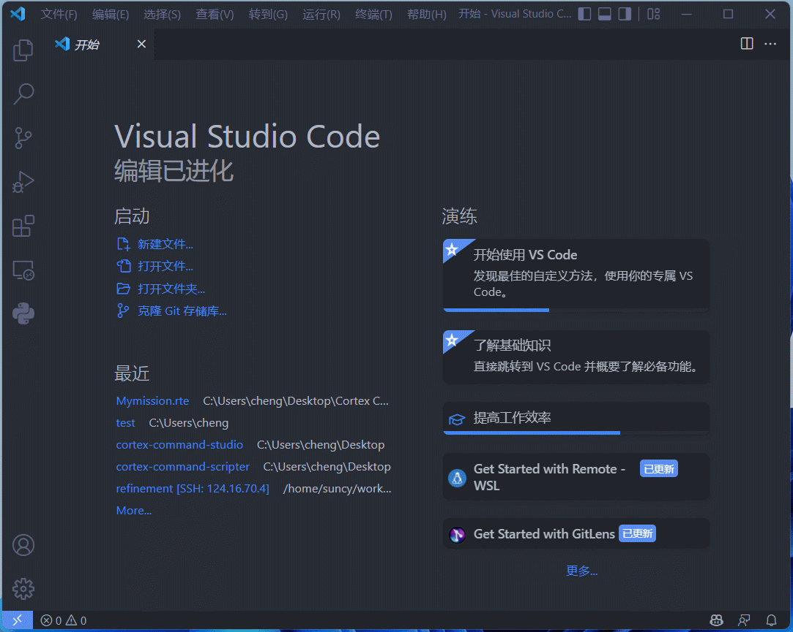
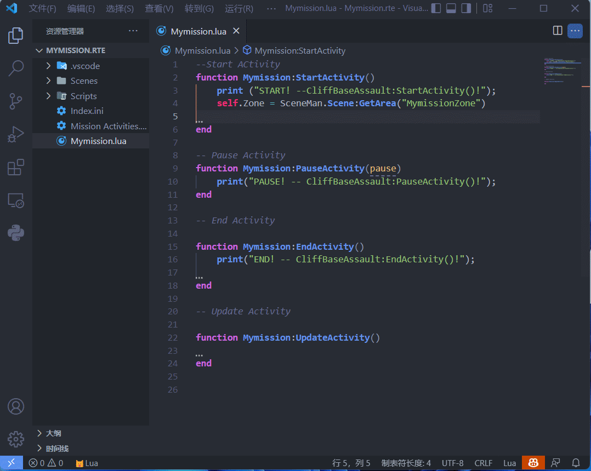
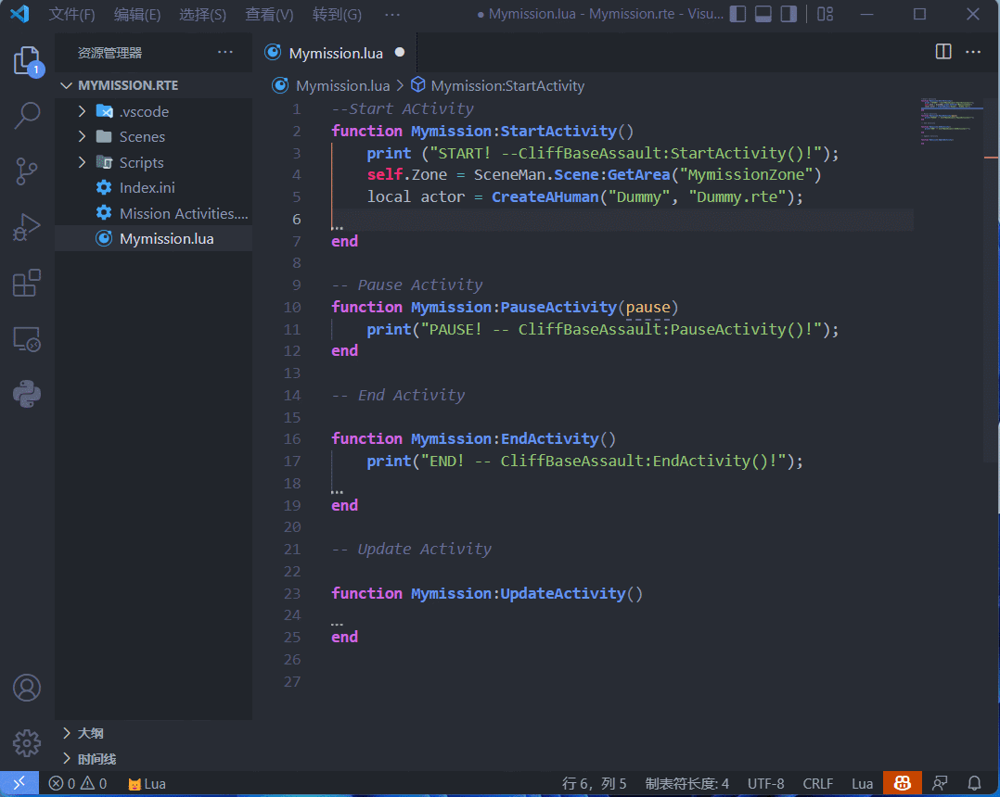
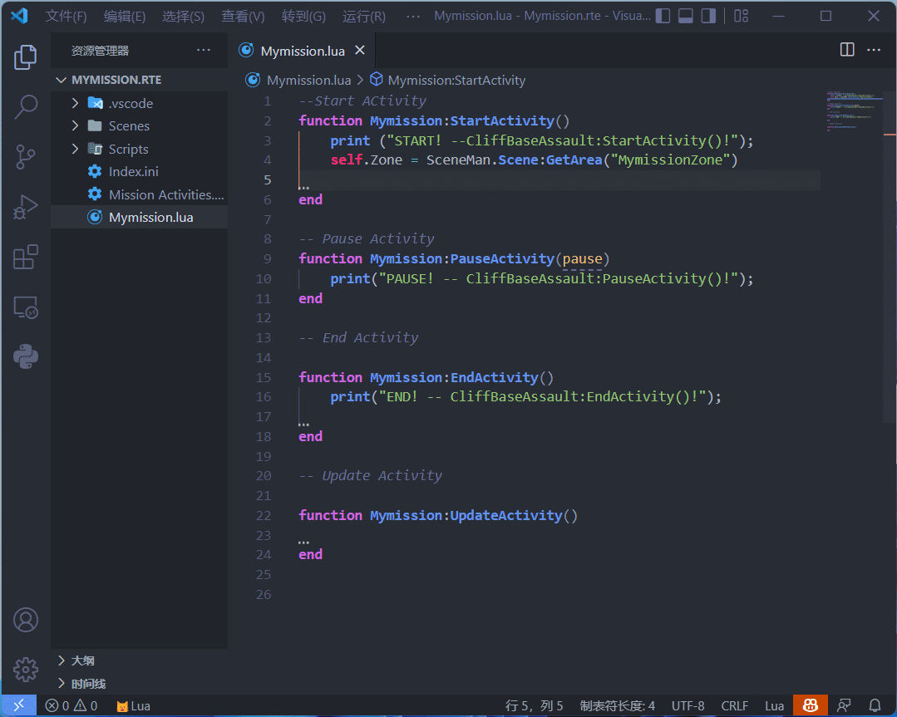
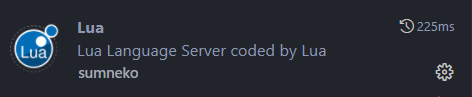

# Cortex Command Scripter
> Target CC Version: Cortex Command Community Project pre-4.0

- [Cortex Command Scripter](#cortex-command-scripter)
  - [Features](#features)
    - [Create Cortex Command Mission Project.](#create-cortex-command-mission-project)
    - [Cortex Command Lua API Completion](#cortex-command-lua-api-completion)
    - [Cortex Command Lua API Reference.](#cortex-command-lua-api-reference)
    - [Cortex Command Snippets.](#cortex-command-snippets)
    - [Create CC Lua API Reference Path](#create-cc-lua-api-reference-path)
  - [Requirements](#requirements)
  - [Release Notes](#release-notes)
- [表层指挥脚本编辑器](#表层指挥脚本编辑器)
  - [功能](#功能)
    - [创建表层指挥任务工程](#创建表层指挥任务工程)
    - [表层指挥Lua接口代码补全](#表层指挥lua接口代码补全)
    - [表层指挥Lua接口提示.](#表层指挥lua接口提示)
    - [表层指挥代码片段.](#表层指挥代码片段)
    - [创建Lua接口设置文件](#创建lua接口设置文件)
  - [相关依赖](#相关依赖)
## Features

### Create Cortex Command Mission Project.
Press `Ctrl+Shift+p` and type `CC Create Project`  to create a Cortex Command mission project.

### Cortex Command Lua API Completion
CC Lua API. APIs are extracted from the doc of [CCCP](https://github.com/cortex-command-community/Cortex-Command-Community-Project-Source/tree/development/Documentation/Parser/LuaDocHtml). But due to some reasons,some APIs are missing. So I added some APIs mannually,and plans to maintain an independent lua documentation just specifically for Lua Reference.

### Cortex Command Lua API Reference.

### Cortex Command Snippets.
Some frequently used snippets. Type `cc` to show them.

### Create CC Lua API Reference Path
If you want to have lua reference in CC mods that not created by this extension. You have to add some setting files to the mod foler.
 You can press `Ctrl+Shift+p` and type `CC Create Setting Folder` to create a setting folder into the mod folder.
## Requirements
Do install the Lua extention of summneko.

## Release Notes
0.1.0

Initial release of Cortex Command Scripter.

Enjoy!

# 表层指挥脚本编辑器
> 面向版本: 表层指挥社区版 pre-4.0
## 功能
### 创建表层指挥任务工程
按下 `Ctrl+Shift+p` 输入 `CC Create Project` 并回车，输入任务名称并选择任务的位置（CC 文件夹即可）来创建任务。

### 表层指挥Lua接口代码补全
表层指挥Lua接口，这些接口是从表层指挥开源项目[CCCP](https://github.com/cortex-command-community/Cortex-Command-Community-Project-Source/tree/development/Documentation/Parser/LuaDocHtml)中的文档中提取的. 不过因为一些原因有一些接口是缺失的，所以我们人工添加了一部分，同时单独维护一份修改后的Lua文档。

### 表层指挥Lua接口提示.

### 表层指挥代码片段.
一些常用的表层指挥代码片段. 输入 `cc` 可以显示所有相关代码片段.

### 创建Lua接口设置文件
如果你想在不是本扩展创建的Mod里开启代码补全功能你必须在这个Mod的文件夹中加入一个设置文件夹。你可以按下`Ctrl+Shift+p` 然后输入 `CC Create Setting Folder` 并指定位置来创建设置文件夹。
## 相关依赖
如果想使用本扩展的功能一定要安装下面这个Lua扩展。

